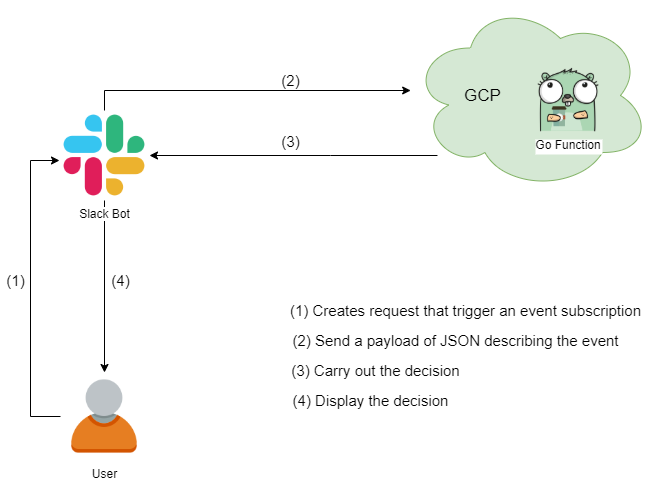

# Simple Slack bot in Go using event API

The idea of writing a Slack bot in Go was first seen at [Rapid loop slackbot for RTM API](https://github.com/rapidloop/mybot).
However, after doing some research, I found that Slack platform provides a
[range of API](https://api.slack.com/apis) that Slack apps can access to, not only RTM API, but also events
 API, web API, Audit Logs APIs, and more. For the purpose of designing a simple app that responds to 
 activities in Slack, [events API](https://api.slack.com/events-api) may be a good choice to start with. 

### Description

As mentioned before, we're going to create some Slack Bots that will response to our requests when
their names are mentioned. Particularly, I have written two Slack bots -
 `weatherbot` that returns current weather condition of a given city in the world, 
 and `stockbot` that returns stock value of a given company. I'm going to show you my way to write `weatherbot` 
 in this repository. And `stockbot` is given in [Stockbot repository](https://github.com/Tracey7d4/stockbot), thus it's easier to follow.


We just need to do some steps to get there.

0. Build a Slack Bot User that subscribed to `app_mention` event

0. Create a Project on Google Cloud Platform (GCP). 
This step is required for deploying cloud function. Therefore that's the main purpose of it

0. Write a Go function with its endpoint managed and routed by Cloud Functions. 
The purpose of the go function is to respond to an event triggered by Slack bot

    

### Implementing

0. **Build a Slack Bot User**

     It will need a Slack space as well to deploy the bot. 
     So either an existing workspace or a new one is required.
     In the [Slack API page](https://api.slack.com/apps), let's create a new app by clicking on the `Create New App` button.
     Next, create a `Bot User` for it. Invite your bot to Slack Channels where you want to interact with it. 
Follow the [link](https://api.slack.com/bot-users) for more details about bot users and how to build one.

    

     We also need to subscribe to [`app_mention` event](https://api.slack.com/events/app_mention). 
     This subscription allows your bot to response to users' requests  that mention its name. 
     We will discuss more detail about event subscribtion later when we have already 
     gone a bit deeper in the coding section.

0. **Create a Project on GCP**
    
    A GCP account is all we need to create a Project on GCP. 
    Follow the instruction of setting up a GCP Project 
    [here.](https://benjamincongdon.me/blog/2019/01/21/Getting-Started-with-Golang-Google-Cloud-Functions)
     
     

0. **Write a Go function**
    
    The final step is writing a Go function for your bot that will be deployed on to GCP.
     If you haven't worked with GCP before, 
     there is an example of `Hello, World` cloud function in the 
    [link](https://benjamincongdon.me/blog/2019/01/21/Getting-Started-with-Golang-Google-Cloud-Functions) 
    given above, that may be really helpful for you to start with. 
    
    Our Go function is routed with each request made to the cloud function, and 
    a response to an incoming request will be written to the `http.ResponseWriter`.    
    
   To make our bot respond to the request when its name is mentioned, 
    we need to [subscribe to the `app_mention` event](https://api.slack.com/events-api). 
    
    **A. Event Subscription**
    
    Go to Your Apps at `https://api.slack.com/apps`, choose the bot, go to `Event Subscription`
    configuration under `Features` section, then turn `Enable Events` to `On`. 
    
    An Event Request URL must be confirmed before subscribing
    to any events and saving the form. Right after you type in a URL, Slack will automatically
    send out an attribution that includes token, challenge, type fields as shown in figure below.
    It is noted that this figure is taken from [Slack usages guide.](https://api.slack.com/events-api)
    
    
    
    The requirement is that our endpoint will respond back with `challenge` attribute value.
    In other words, our function needs to catch the `challenge` value and send it back to Slack 
    for the first time running. Following is a Go function that performs the task. 
      
    ```go
    func AppWeatherMentionHandler(w http.ResponseWriter, r *http.Request) {
    	// get the request body
    	defer r.Body.Close()
    	body, _ := ioutil.ReadAll(r.Body)
     	m := make(map[string]interface{})
    	json.Unmarshal(body, &m)
    	fmt.Fprintf(w, "%s", m["challenge"])
     }
    ```
    
    Deploy this function by following command
    
    ```shell script
    gcloud functions deploy AppWeatherMentionHandler --runtime go111 --trigger-http
    ```
    Answer `y` to the question about unauthenticated access.
    In the returning log you can see the URL that points to your newly created 
    cloud function as an endpoint for your web service. Copy and paste this link to the `Request URL` panel on 
    web Slack app till the field turned to `Verified`
        
     
     
     Once the URL is successfully verified, click on `Add Bot User Event`, 
     choose `app_mention` event and then save the form `Save changes`. 
     
     
     
     We have already done with subscribing an event for our bot. 
    Now come back with our Go function `weatherbot`.
        
      **B. Slack Weather Bot**
        
      Our Go function `AppWeatherMentionHandler` is programmed for doing several subsequent tasks as follows.
      
      0.  Get the city's name `city` from the payload of JSON describing the event;
      0.  Send `city` to `getWeather` function to get the `weather` message;
      0.  Call `sendMessage` function with obtained variables to display the response in Slack Channels.
      
      The `JSON` payload that is received by our server can be displayed as follow. 
           
      ```shell script
           "token": "*****************************",
           "team_id": "**************",
           "api_app_id": "********",
           "event": {
           "client_msg_id": "************************",
           "type": "app_mention",
               "text": "<@ your bot user_ID> Melbourne, Au",
               "user": "************",
               "ts": "1592101177.000800",
               ....
     ```
       
     We're going to use Go map to extract the information that we're interested in. Apart from city's name that is used 
     as an input for `getWeather` function, I'm also going to extract `token` and `channel` fields as those are required in
     my `sendMessage` function. 
       
     ```shell script
         body, _ := ioutil.ReadAll(r.Body)
         m := make(map[string]interface{})
         json.Unmarshal(body, &m)         
         m1 := m["event"].(map[string]interface{})
         text := fmt.Sprintf("%v", m1["text"])
         str := strings.Split(text, "<bot user ID>")
         city := strings.Trim(str[1], " ")
   ```
    Send `city` variable to `getWeather` function as an input.
    ```shell script
        weather, err := getWeather(city)
   ``` 
    There are many weather web pages provide API that we can choose from. I am using [openweathermap.org
    API](https://openweathermap.org/api) to get all the free current weather information for my app. 
          This web page requires an `appID`, and all you need to do to get one is signing up an account on this website.
          You can check current weather API documentation [here](https://openweathermap.org/current). 
          As shown in the documentation, to search for current weather of a city by
           its name, and obtained values are displayed in cubic metric, the syntax for that URL 
           should be as follows.
    ```shell script
         http://api.openweathermap.org/data/2.5/weather?q=<city_name>&units=metric&APPID=<appID>
    ```       
    We now need to check for the returning body from `openweathermap.org`. 
      When input data could not be found, such as the request name has typo or 
      there is no data for that city, a returning message 
      `{"cod":"404","message":"city not found"}` is obtained.
      In that case, we would like our bot to display a message to Slack channel 
       as `City <city_name> is not found`. 
       Otherwise, weather information will be extracted from `body` and demonstrated to a string `s`, 
       which will be passed as `weather` variable when we call function `sendMessage` in our 
    `AppWeatherMentionHandler` function.
      
   ```shell script
   err = sendMessage(token, channel, weather)
               if err != nil {
                   fmt.Fprintf(w, "error: %v", err)
               }
   ```
    When GCP server send back the message to Slack, it's Slack's turn to display the message to the user.
    As Slack supports [formatting text object,](https://api.slack.com/reference/surfaces/formatting#visual-styles) 
   I have also modified the message that server has carried out to Slack. 
   For example, some special symbols are passed on returning varialbe `s` on `getWeather` function, such as `*` (for **Bold**),
  `_` (for _Italic_), and even an `emojimap` is created to add some [weather](https://openweathermap.org/weather-conditions)
  [emoji icons](https://www.webfx.com/tools/emoji-cheat-sheet/).

    Our `AppWeatherMentionHandler` function now is ready to deploy to GCP.

   ```shell script
   gcloud functions deploy AppWeatherMentionHandler --runtime go111 --trigger-http
   ```

    Once Go function is successfully deployed, you can type in a request on your Slack channel. 
    For instance, you would like to know how the weather at Melbourne, 
    Australia is, so you type in your request (remember to mention your bot first).

   ```
   @weatherbot Melbourne, Au
   ```
   And that is what will be displayed in your Slack channel

   


   
### Conclusion
   
   Now you have a bot handy to check for weather. Follow [this link](https://github.com/Tracey7d4/stockbot) 
   for Stockbot that giving you stock values of some companies that you're interested.
   

### API reference


* [Rapid loop slackbot for RTM API](https://github.com/rapidloop/mybot)
* [Slack API](https://api.slack.com/apis)
* [Slack Event API](https://api.slack.com/events-api)
* [Create a Slack App](https://api.slack.com/apps)
* [Slack Bot users](https://api.slack.com/bot-users)
* [App_mention event](https://api.slack.com/events/app_mention)
* [GCP cloud function example](https://benjamincongdon.me/blog/2019/01/21/Getting-Started-with-Golang-Google-Cloud-Functions/)
* [Open Weather](https://openweathermap.org/api)
* [Current Weather API doc](https://openweathermap.org/current)
* [Formatting Text](https://api.slack.com/reference/surfaces/formatting#visual-styles)
* [Weather condition](https://openweathermap.org/weather-conditions)
* [Emoji](https://www.webfx.com/tools/emoji-cheat-sheet/)
* [Golang http](https://medium.com/@masnun/making-http-requests-in-golang-dd123379efe7)
* [Markdown](https://guides.github.com/features/mastering-markdown/)
* [Basic writting and formatting on Gibthub](https://help.github.com/en/github/writing-on-github/basic-writing-and-formatting-syntax#section-links)
* [Stockbot repository](https://github.com/Tracey7d4/stockbot)