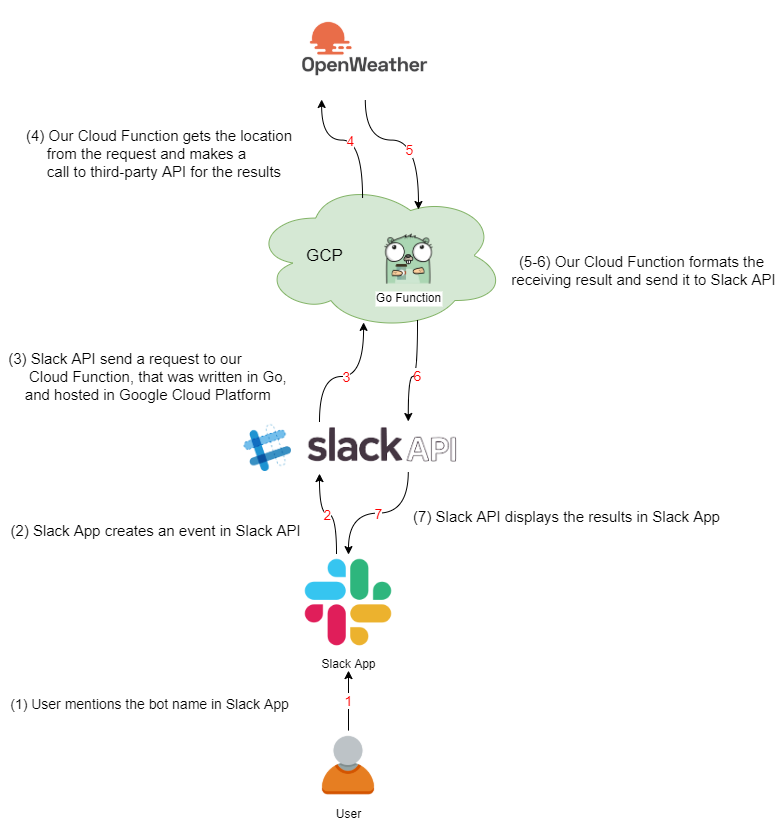

# Simple Slack bot in Go using event API


In this repository, I'm going to create a `weatherbot` for querying weather condition of a given location. The idea of writing a Slack bot in Go was inspired by [rapidloop's slackbot for RTM API](https://github.com/rapidloop/mybot). At the moment, Slack platform provides a [range of APIs](https://api.slack.com/apis) that Slack apps can access to including events API, web API, Audit Logs APIs beside RTM API which was used in rapidloop's implementation. As RTM API is being phased out in favour of events API, in this application, [events API](https://api.slack.com/events-api) will be used.

### Architecture
The architecture of the application can be seen in the diagram below.

 

When a bot is mentioned in Slack App, an event is created on Slack Event API. That event will trigger a call out to a cloud function.The cloud function was written in Go and hosted on [Google Cloud Platform (GCP)](https://cloud.google.com/functions/). The function gets the location from the request, calls out to a third-party API, which is [openweathermap](https://openweathermap.org/api) in this case, to get the weather information. The function then formats the final message with that information before sending it back to Slack API to display in Slack App. 

Creating such bot required the following steps

0. Build a Slack Bot User that subscribes to `app_mention` event

0. Create a project on GCP to deploy the cloud function.

0. Create a Go function which is a HTTP handler that responds to events triggered by Slack bot


### Implementation

0. **Build a Slack Bot User**

     It will need a Slack workspace as well to deploy the bot. So either an existing workspace or a new one is required. In [Slack API page](https://api.slack.com/apps), let's create a new app by clicking on the `Create New App` button. Next, create a `Bot User` for it. Invite your bot to Slack channels where you want to interact with it. Follow the [link](https://api.slack.com/bot-users) for more details about bot users and how to build one.

    

     We also need to subscribe to [`app_mention` event](https://api.slack.com/events/app_mention). This subscription allows your bot to response to users' requests  that mention its name. 

0. **Create a project on GCP**
    
    A GCP account is all we need to create a Project on GCP. Follow the instruction of setting up a GCP Project [here.](https://benjamincongdon.me/blog/2019/01/21/Getting-Started-with-Golang-Google-Cloud-Functions)
     
     

0. **Create a Go function**
    
    The final step is writing a Go function for your bot that will be deployed on to GCP. If you haven't worked with GCP before, there is an example of `Hello, World` cloud function in the [link](https://benjamincongdon.me/blog/2019/01/21/Getting-Started-with-Golang-Google-Cloud-Functions) given above, which can serve as an excellent starting point. 
    
    Our Go function is routed with each request made to the cloud function, and a response to an incoming request will be written to the `http.ResponseWriter`. More details on this will be provided in a later section.
    
   To make our bot respond to the request when its name is mentioned, we need to [subscribe to the `app_mention` event](https://api.slack.com/events-api). 
    
    **A. Event Subscription**
    
    Go to Your Apps at `https://api.slack.com/apps`, choose the bot, go to `Event Subscription` configuration under `Features` section, then turn `Enable Events` to `On`. 
    
    An Event Request URL must be confirmed before subscribing to any events and saving the form. Right after you type in a URL, Slack will automatically send out an attribution that includes token, challenge, and type fields as shown in figure below. It is noted that this figure is taken from [Slack usages guide](https://api.slack.com/events-api). Yours will look different.
    
    
    
    The requirement is that our endpoint will respond back with `challenge` attribute value. In other words, our function needs to catch the `challenge` value and send it back to Slack for the first time running. Following is the function that performs the task.
      
    ```go
    func AppWeatherMentionHandler(w http.ResponseWriter, r *http.Request) {
    	// get the request body
    	defer func() {
        		_ = r.Body.Close()
        	}()
    	body, _ := ioutil.ReadAll(r.Body)
     	m := make(map[string]interface{})
    	err := json.Unmarshal(body, &m)
        	if err != nil {
        		_, _ = fmt.Fprintf(w, "error unmarshalling body: %v", err)
        		return
        	}
    	fmt.Fprintf(w, "%s", m["challenge"])
     }
    ```
    
    Deploy this function by following command
    
    ```
    gcloud functions deploy AppWeatherMentionHandler --runtime go111 --trigger-http
    ```
    Answer `y` to the question about unauthenticated access.
    
    
    In the returning log you can see the URL that points to your newly created cloud function as an endpoint for your web service. Copy and paste this link to the `Request URL` panel on web Slack app till the field turned to `Verified`
        
     
     
     Once the URL is successfully verified, click on `Add Bot User Event`, choose `app_mention` event and then save the form `Save changes`. 
     
     
     
     We have already done with subscribing an event for our bot. Now come back with our Go function for `weatherbot`.
        
      **B. Slack Weather Bot**
        
      Our Go function `AppWeatherMentionHandler()` is a HTTP handler that does the following tasks
      
      0.  Get the city name from the JSON payload describing the event and assign it to a variable `city`;
      0.  Call a local function `getWeather()` to get `weather` message;
          * get the weather from openweathermap
          * format the return message
      0.  Call `sendMessage()` function to display the response in Slack channels.
      
      In the first step, the `JSON` payload from Slack API will look like this. 
           
      ```
           "token": "*****************************",
           "team_id": "**************",
           "api_app_id": "********",
           "event": {
           "client_msg_id": "************************",
           "type": "app_mention",
               "text": "<@ your bot user_ID> Melbourne, Au",
               "user": "************",
               "ts": "1592101177.000800",
               ....
     ```
       
     We're going to unmarshall this JSON into a map to extract the information of interest. Apart from the city name I also need the `token` and `channel` fields as they are required to send the message back to Slack later.
       
     ```
        body, _ := ioutil.ReadAll(r.Body)
        m := make(map[string]interface{})
        err := json.Unmarshal(body, &m)
        if err != nil {
            _, _ = fmt.Fprintf(w, "error unmarshalling body: %v", err)
            return
        }      
        m1 := m["event"].(map[string]interface{})
        text := fmt.Sprintf("%v", m1["text"])
        str := strings.Split(text, "<bot user ID>")
        city := strings.Trim(str[1], " ")
        channel := fmt.Sprintf("%v", m1["channel"])
        token := "User's Slack Bot Token"
   ```
    Call `getWeather()` with `city` variable as an input.
    ```
        weather, err := getWeather(city)
   ``` 
    I am using [openweathermap.org API](https://openweathermap.org/api) to get weather information. This API requires an `appID`, and all you need to do to get one is signing up an account on its website. You can check API documentation for current weather [here](https://openweathermap.org/current). To get current weather of a city by name with returned values in cubic metric you need to call the following endpoint.
    
    ```
         http://api.openweathermap.org/data/2.5/weather?q=<city_name>&units=metric&APPID=<appID>
    ```       
    
    If the data for that city could not be found, `{"cod":"404","message":"city not found"}` is returned. In this case, our bot will display `City <city_name> is not found` to the user. Otherwise, weather information will be extracted from the response and put into a formatted Slack message, which  will subsequently be sent back to Slack when calling `sendMessage()`.
      
   ```
   err = sendMessage(token, channel, weather)
               if err != nil {
                   fmt.Fprintf(w, "error: %v", err)
               }
   ```
    
   As Slack supports [formatting text object,](https://api.slack.com/reference/surfaces/formatting#visual-styles) 
   the message can be prettied by using some special symbols such as `*` (for **Bold**), `_` (for _Italic_). I even created an `emojimap` to add some [weather](https://openweathermap.org/weather-conditions)
  [emoji icons](https://www.webfx.com/tools/emoji-cheat-sheet/).

   Our `AppWeatherMentionHandler` function is now ready to deploy to GCP.

   ```
   gcloud functions deploy AppWeatherMentionHandler --runtime go111 --trigger-http
   ```

    Once it is successfully deployed, you can try the bot out on your Slack channel. For instance, if you want to know how the weather at Melbourne, Australia is, you mention your bot like follows.

   ```
   @weatherbot Melbourne, Au
   ```
   And this is what will be displayed in your Slack channel

   
   
### Conclusion
   
   Well done! Now you have a working bot handy for checking weather. Follow [this link](https://github.com/Tracey7d4/stockbot) for another amazing bot that allows you to quote stock price.
   
### References

* [Rapid loop slackbot for RTM API](https://github.com/rapidloop/mybot)
* [Slack API](https://api.slack.com/apis)
* [Slack Event API](https://api.slack.com/events-api)
* [Google Cloud Platform](https://cloud.google.com/functions/)
* [openweathermap API](https://openweathermap.org/api)
* [Create a Slack App](https://api.slack.com/apps)
* [Slack Bot users](https://api.slack.com/bot-users)
* [App_mention event](https://api.slack.com/events/app_mention)
* [GCP cloud function example](https://benjamincongdon.me/blog/2019/01/21/Getting-Started-with-Golang-Google-Cloud-Functions/)
* [Current Weather API doc](https://openweathermap.org/current)
* [Formatting Text](https://api.slack.com/reference/surfaces/formatting#visual-styles)
* [Weather condition](https://openweathermap.org/weather-conditions)
* [Emoji](https://www.webfx.com/tools/emoji-cheat-sheet/)
* [Golang http](https://medium.com/@masnun/making-http-requests-in-golang-dd123379efe7)
* [Markdown](https://guides.github.com/features/mastering-markdown/)
* [Basic writting and formatting on Gibthub](https://help.github.com/en/github/writing-on-github/basic-writing-and-formatting-syntax#section-links)
* [Stockbot repository](https://github.com/Tracey7d4/stockbot)